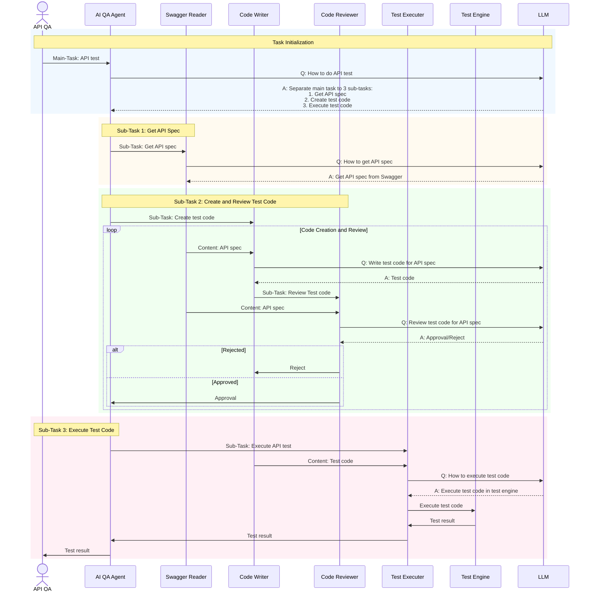

# AI QA API Agent

This is an AI empowered solution to automate generate test code for testing RestFul API endpoints.

This solution is based Autogen multiple AI agent architecture.

## Process Flow
### Create test code for RestFul API

```mermaid
flowchart
    %% Define styles
    classDef default fill:#f9f9f9,stroke:#333,stroke-width:2px;
    classDef highlight fill:#e1f5fe,stroke:#01579b,stroke-width:3px;
    classDef llm fill:#fff8e1,stroke:#ff6f00,stroke-width:2px;
    classDef output fill:#e8f5e9,stroke:#1b5e20,stroke-width:2px;

    %% API-Server subgraph (left)
    subgraph API-Server["🖥️ API Server"]
        direction TB
        APIServer("🔌 API Endpoint")
        SwaggerServer("📚 Swagger Server")
    end

    %% Main Swagger-QA-Agent subgraph (middle)
    subgraph Swagger-QA-Agent["Swagger QA Agent"]
        direction TB
        QAAgent("🤖 AI QA Agent")
        SwaggerReader("🔍 Swagger Reader")
        CodeWriter("✍️ Code Writer")
        CoderReviewer("👀 Code Reviewer")
        TestExecuter("🧪 Test Executer")

        QAAgent -- "1 Ask API" --> SwaggerReader
        SwaggerReader -- "3 API Spec" --> QAAgent
        QAAgent -- "4 Test Task" --> CodeWriter
        CodeWriter -- "5 Code" --> CoderReviewer
        CoderReviewer -- "6 Feedback" --> CodeWriter
        CodeWriter -- "7 Code" --> TestExecuter
        TestExecuter -- "11 Test Result" --> QAAgent
    end

    %% Output subgraph (right)
    subgraph report["📊 Report"]
        direction TB
        slack("💬 Slack")
    end

    %% Output subgraph (right)
    subgraph output["Outputs"]
        direction TB
        apiSpec("📄 API Spec Doc")
        testScript("📜 Code")
        pr("🔀 PR")
    end

    %% Other elements
    TestEngine("⚙️ Test Engine")
    LLM["🧠 GPT-4o-mini"]

    %% Cross-graph links
    SwaggerServer <--> |"2 Get API Info"| SwaggerReader
    TestExecuter --> |"8 Execute Test"| TestEngine
    TestEngine --> |"10 Test Result"| TestExecuter
    TestEngine <--> |"9 API Test"| APIServer
    QAAgent -.-> LLM
    CodeWriter -.-> LLM
    CoderReviewer -.-> LLM
    SwaggerReader -.-> LLM
    TestExecuter -.-> LLM
    QAAgent --> report
    SwaggerReader ==> apiSpec
    CodeWriter ==> testScript
    CoderReviewer ==> pr

    %% Apply styles
    class SwaggerReader,QAAgent,CodeWriter,CoderReviewer,TestExecuter highlight;
    class LLM llm;
    class pr,slack,apiSpec,testScript output;
```

## Multiple AI Agents workflow

```mermaid
flowchart LR
    %% Define styles
    classDef group fill:#e0f7fa,stroke:#006064,stroke-width:2px
    classDef agent fill:#fff9c4,stroke:#f57f17,stroke-width:2px,color:#000
    classDef action fill:#f3e5f5,stroke:#4a148c,stroke-width:1px,color:#000

    subgraph Handoffs["Handoffs Group"]
        direction TB
        QAAgent("🤖 AI QA Agent")
        SwaggerReader("🔍 Swagger Reader")
        TestExecuter("🧪 Test Executer")
    end

    subgraph Reflection["Reflection Group"]
        direction TB
        CodeWriter("✍️ Code Writer")
        CodeReviewer("👀 Code Reviewer")
    end

    %% Define relationships
    QAAgent -->|1 Ask API| SwaggerReader
    SwaggerReader -->|3 API Spec| QAAgent
    QAAgent -->|4 Test Task| Reflection
    CodeWriter -->|5 Code| CodeReviewer
    CodeReviewer -->|6 Feedback| CodeWriter
    Reflection -->|7 Code| TestExecuter
    TestExecuter -->|11 Test Result| QAAgent

    %% Apply styles
    class Handoffs,Reflection group
    class QAAgent,SwaggerReader,TestExecuter,CodeWriter,CodeReviewer agent
    class Handoffs,Reflection agent
```

### Chain-of-Thought (CoT)

## References:
- [AutoGen dev version](https://microsoft.github.io/autogen/dev/)
- [AI-Data-Analysis-MultiAgent](https://github.com/starpig1129/AI-Data-Analysis-MultiAgent)
