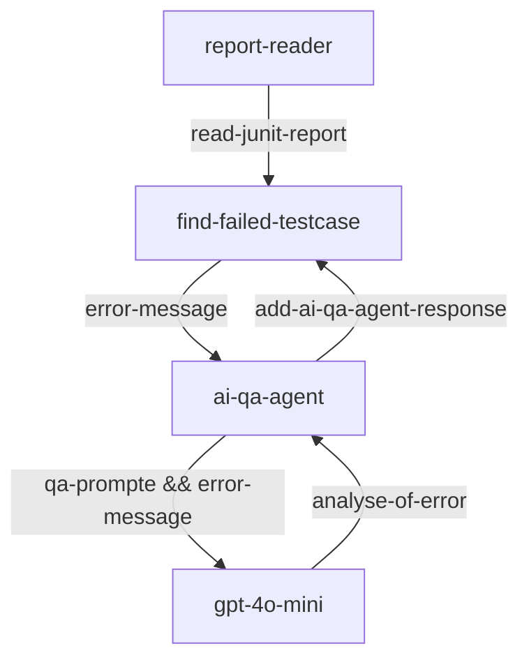
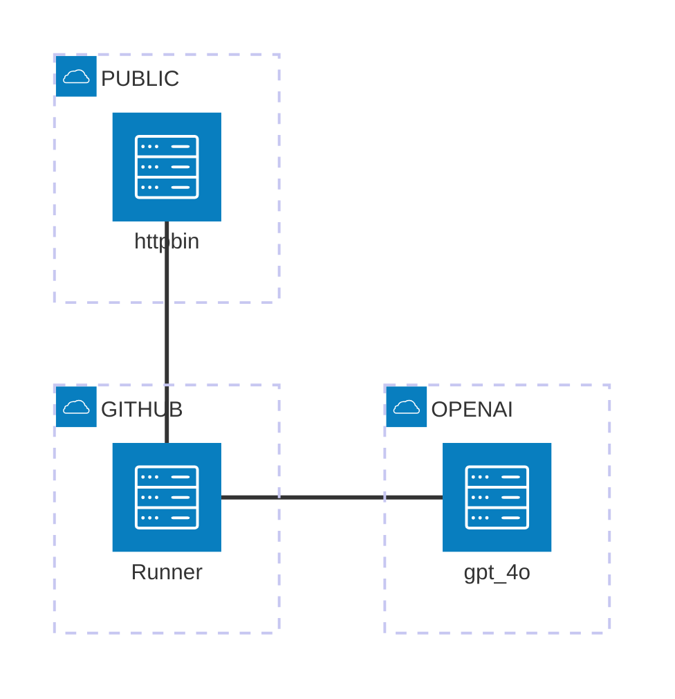

# Rest API testing with AI assisted
A sample RestAPI test by RestAssured test framework, and the testing generetats Junit Test report, the error log will be analyisted by LLM.

The AI agent uses AutoGen framework.

## Process Flow


## Architecture


## QA Prompt
```
You are an experianxe QA engineer, you read error_message and then investgate the root cause of the error based on POSSIBLE_ISSUES, 
and provide solution from POSSIBLE_SOLUTIONS, reply clear and short message in json that follow EXAMPLE_ANSWER.
<POSSIBLE_ISSUES>
- expectation failed of returned http status code
- expectation failed in returned header
- expectation failed in returned body
</POSSIBLE_ISSUES>

<POSSIBLE_SOLUTIONS>
- if expection failed, test script need update or test api has regression issue.
</POSSIBLE_SOLUTIONS>

<EXAMPLE_ANSWER>
{
    "error_message": "",
    "error_field": "",
    "expected_value": "",
    "actual_value": "",
    "solution": ""
}
</EXAMPLE_ANSWER>
```

## AI QA agent analyses
```
AI message: 
{
    "error_message": "1 expectation failed.",
    "error_field": "Access-Control-Allow-Origin",
    "expected_value": "https://httpbin.org",
    "actual_value": "*",
    "solution": "if expectation failed, test script needs update or test api has regression issue."
} 

1 expectation failed. Expected header "Access-Control-Allow-Origin" was not "https://httpbin.org", was "*". Headers are: Date=Thu, 28 Nov 2024 22:10:31 GMT Content-Type=application/json Content-Length=556 Connection=keep-alive Server=gunicorn/19.9.0 Access-Control-Allow-Origin=* Access-Control-Allow-Credentials=true
```
